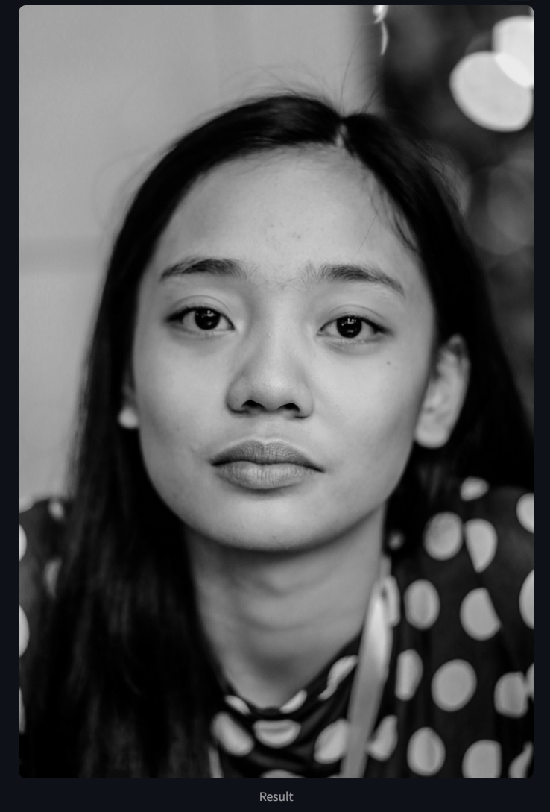
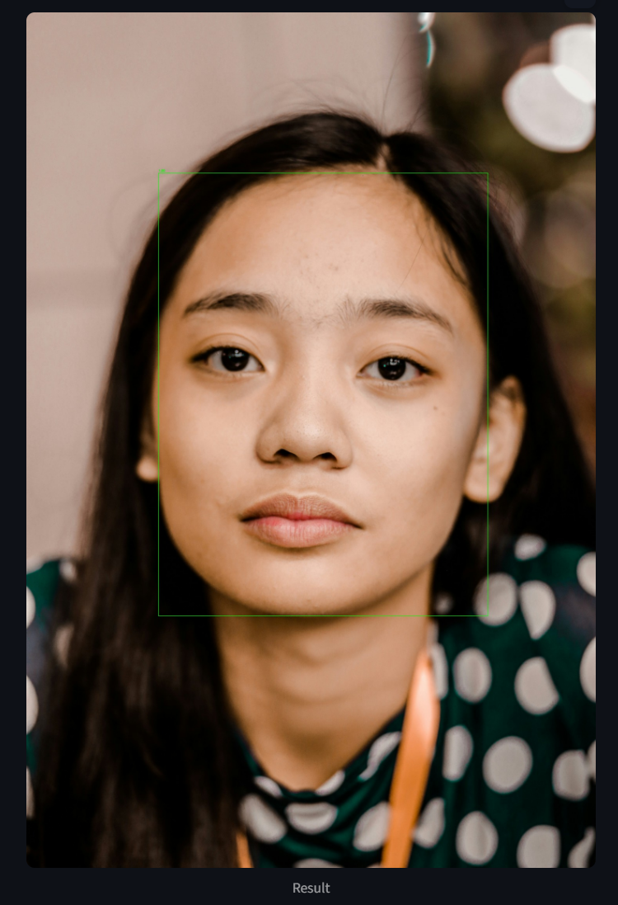
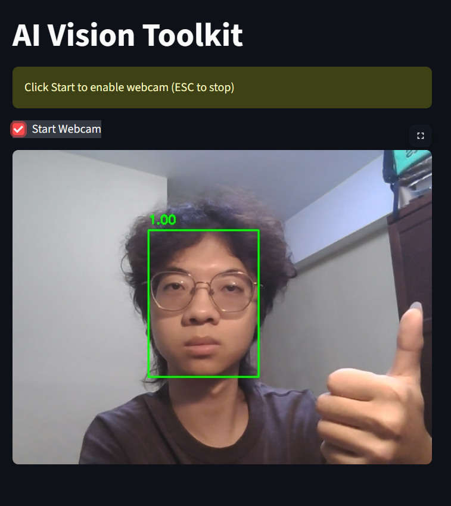

# AI_Vision_Lab

> A modular computer vision workbench for running, comparing, and benchmarking vision pipelines on the same input.

---

## Overview

AI_Vision_Lab is an interactive computer vision playground that integrates:

- Classical OpenCV image processing
- AI-based face detection (Haar / DNN)
- YOLO object detection with tunable inference parameters
- Vision Workbench with before/after comparison, run history, and JSON export
- **Model Compare** for side-by-side multi-pipeline evaluation on one image
- **Benchmark** for batch runs and optional ground-truth metrics
- Real-time webcam inference
- Dynamic pipeline switching through a registry layer

The goal is to demonstrate a **modular AI vision architecture**, not just isolated scripts.

---

## Features

### Image Processing
- Grayscale conversion
- Gaussian Blur
- Canny Edge Detection
- Histogram Equalization
- Morphological operations (dilate / erode)

### AI Face Detection
- Haar Cascade face detection
- Deep learning-based DNN face detection
- YOLOv8 object detection (`yolov8n.pt`)
- Confidence / IoU / max-detection tuning
- Structured bounding-box annotations and metrics
- Category-based pipeline selection (`Image Processing` / `AI Vision`)
- Before/after comparison, run history, and JSON export

### Model Compare
- Compare up to 4 pipelines on the same uploaded image
- Comparison groups (`face_detection`, `object_detection`, `edge_detection`, etc.)
- Side-by-side result grid with detection vs processing metric tabs
- Latency, detection count, confidence, and pixel-change metrics
- Saved comparison sessions with JSON/CSV export

### Benchmark
- Batch evaluation across multiple uploaded images
- Leaderboard with average latency and detection stats
- Optional ground-truth JSON for precision / recall / F1 (IoU threshold configurable)

### Real-time Webcam
- Live video processing
- Real-time DNN face detection
- Mirror preview in Streamlit

---

## System Design

```
Streamlit UI (Workbench / Compare / Benchmark / Catalog / Webcam)
   ↓
Category + Pipeline Selector
   ↓
model_registry.py (VisionPipeline registry)
   ↓
comparison_runner.py / benchmark_runner.py
   ↓
OpenCV / DNN / YOLO pipelines
   ↓
PipelineResult (image + annotations + metrics)
   ↓
history_store.py (SQLite + saved images)
   ↓
Processed output + JSON / CSV export
```

Key idea: separation of UI, pipeline registry, comparison/benchmark runners, and persisted history for scalability.

---

## Project Structure

```
AI_Vision_Lab/
│
├── app.py
├── requirements.txt
├── yolov8n.pt
├── tests/
│   └── test_comparison.py
│
├── assets/
│   ├── face_detection.png
│   ├── image_processing.png
│   └── webcam.png
│
├── data/
│   ├── vision_history.sqlite
│   └── history_images/
│
├── models/
│   ├── deploy.prototxt
│   └── res10_300x300_ssd.caffemodel
│
└── src/
    ├── filters.py
    ├── edges.py
    ├── histogram.py
    ├── morphology.py
    ├── haar_face_detection.py
    ├── dnn_face_detection.py
    ├── yolo_detection.py
    ├── pipeline_result.py
    ├── metrics_utils.py
    ├── comparison_runner.py
    ├── benchmark_runner.py
    ├── ground_truth.py
    ├── history_store.py
    └── model_registry.py
```

---

## Demo

### Image Processing


### Face Detection


### Webcam Mode


---

## Installation

```bash
git clone https://github.com/hubertkuo418/ai-vision-lab.git
cd ai-vision-lab
pip install -r requirements.txt
```

> On first YOLO run, Ultralytics may download model weights if `yolov8n.pt` is not present locally.

---

## Run

```bash
streamlit run app.py
```

Open the sidebar to switch between **Vision Workbench**, **Model Compare**, **Benchmark**, **Model Catalog**, and **Webcam**.

### Ground truth format (Benchmark)

```json
{
  "photo.jpg": [
    {"label": "face", "x": 120, "y": 80, "width": 64, "height": 64}
  ]
}
```

Use a single list instead of a filename map to apply the same boxes to every uploaded image.

---

## Key Concepts

- Classical computer vision fundamentals
- Deep learning-based inference (OpenCV DNN + YOLO)
- Structured pipeline results (`PipelineResult`)
- Comparison groups and unified runtime metrics (`latency_ms`, detections, etc.)
- Real-time video processing pipeline
- Modular architecture design
- Model abstraction layer (`VisionPipeline` registry)
- UI + backend + persistence separation
- Single-run history and multi-model comparison sessions

---

## Future Work

- Face recognition (identity-level system)
- FPS overlay and live performance monitoring in Webcam
- Snapshot & recording system
- Webcam pipeline switching (Haar / YOLO compare mode)
- Additional YOLO model sizes (`s`, `m`) in the catalog

---

## Author

Built by: Hubert Kuo  
Focus: Computer Vision / AI Systems / Machine Learning
